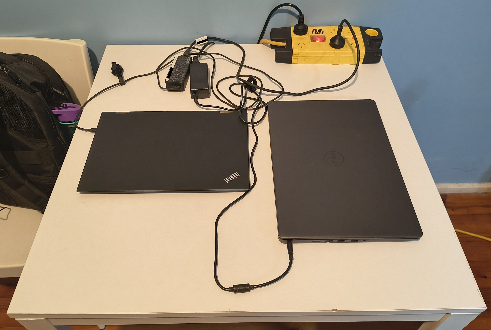
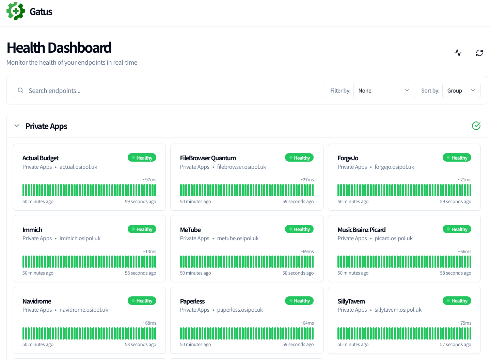
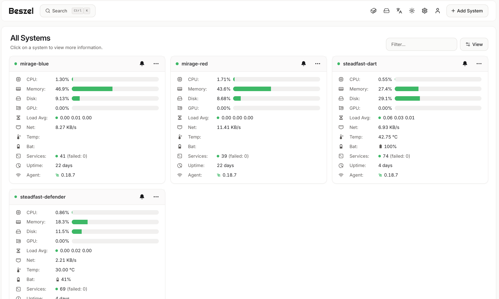
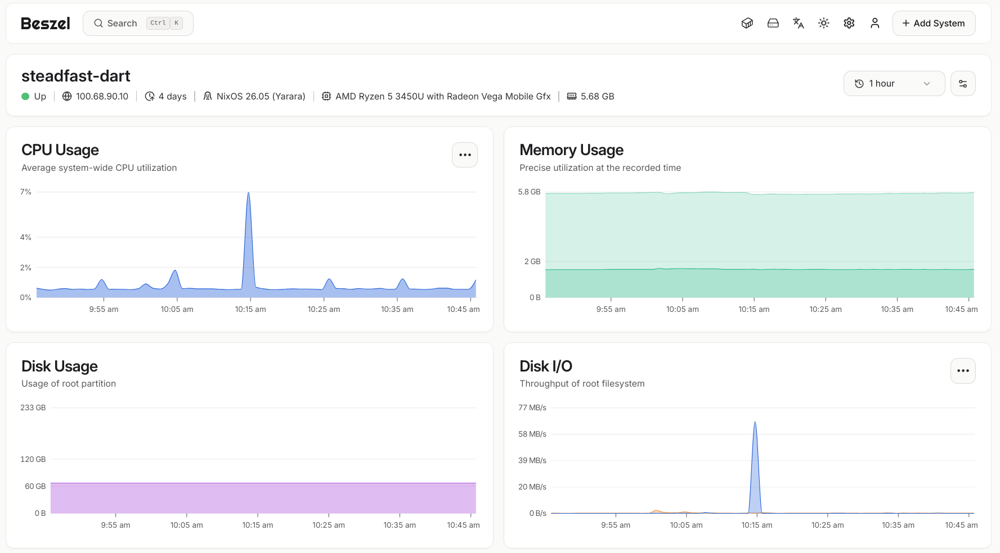

# nixos-config

My personal NixOS config. I do things on my computer and self-host stuff.

**Uptime tracker:** [https://uptime.osipol.uk/](https://uptime.osipol.uk/)

## Software
- Window manager: [niri](https://github.com/niri-wm/niri)
- Desktop shell: [Noctalia Shell](https://github.com/noctalia-dev/noctalia)
- Editor: [Neovim](https://neovim.io/)
- Terminal: [foot](https://codeberg.org/dnkl/foot)
- Shell: [Fish](https://fishshell.com/)

## Features
- Hosts multiple services including a password management server ([Vaultwarden](https://github.com/dani-garcia/vaultwarden)), music server ([Navidrome](https://www.navidrome.org/)), and Nix binary cache ([attic](https://github.com/zhaofengli/attic)).
- Pull-based deployment with [comin](https://github.com/nlewo/comin) and GitHub Actions.
- Secret management with [sops-nix](https://github.com/Mic92/sops-nix).
- Automated backups with [Restic](https://restic.net/).
- Uptime monitoring with [Gatus](https://gatus.io).
- System monitoring with [Beszel](https://www.beszel.dev/).

## Gallery
<details open>
<summary>Home servers</summary>
<br>


<blockquote>
  My two home servers (from left: <em>steadfast-defender</em>, <em>steadfast-dart</em>), as of September 2026.
</blockquote>

  
</details>

<details>
<summary>Uptime dashboard</summary>

<br>


<blockquote>
  Screenshot of <a href="https://uptime.osipol.uk">uptime.osipol.uk</a> (as of 08/09/2026)
</blockquote>

</details>

<details>
<summary>Server monitoring</summary>

<br>


<blockquote>
  Server overview (as of 08/09/2026).
</blockquote>


<blockquote>
  View for a single server (as of 08/09/2026).
</blockquote>

</details>

## Installation
1. Build the custom ISO and burn it onto a USB with `nix run github:queze1/nixos-config#burn-iso-image`.
  - Don't do this unless you're me, as it's configured to allow SSH from my public key.
  - Alternatively, you can use an ISO from the [official website](https://nixos.org/download/).
2. Boot the target machine with the USB stick.
3. On the target machine, run:
```bash
nmtui # if using custom ISO
ip addr
```
4. On your source machine, run:
```bash
# not general use, assumes a lot
nix run .#install -- <target-machine-ip> <hostname> [nixos-facter path]

# configure secrets when prompted
```

## CI/CD
1. [nixbuild GitHub Action](https://github.com/queze1/nixos-config/blob/main/.github/workflows/nixbuild.yml) builds NixOS configurations on [nixbuild.net](https://nixbuild.net/). If the build succeeds, fast-forwards the `deployed` branch to `main`.
2. [comin](https://github.com/nlewo/comin/) periodically pings the `deployed` branch. On a new commit, it pulls the branch, builds its NixOS configuration, and switches.
3. The [Build VPS Toplevels](https://github.com/queze1/nixos-config/blob/main/.github/workflows/build-vps-toplevels.yml) GitHub action builds the NixOS configurations of VPSes, pushes them to a self-hosted [Attic](https://github.com/zhaofengli/attic) binary cache, and creates a GitHub release with their store paths. The [system-puller](https://github.com/queze1/nixos-config/blob/main/modules/deployment/system-puller.nix) systemd service periodically polls the latest GitHub release. When a new NixOS configuration is published, it will fetch its system closure from the binary cache and switch to it.
4. On an automated flake update pull request, a [GitHub Action](https://github.com/queze1/nixos-config/blob/main/.github/workflows/build.yml) builds all NixOS configurations on GitHub runners and pushes the results to the binary cache.

## Project Structure
flake-parts for flake outputs, every nixosConfiguration does an import-tree on /modules, uses my.* options to toggle modules.
```
.
├── flake.nix                      # imports everything in /outputs
├── docs                           # assets for README.md
├── modules
│   ├── constants.nix
│   ├── deployment                 # deployment tooling (e.g. comin)
│   ├── desktop                    # desktop environment (e.g. niri)
│   ├── hosting                    # self-hosted applications & networking
│   │   ├── infra
│   │   ├── music
│   │   │   ├── default.nix
│   │   │   ├── ...
│   │   │   └── navidrome.nix
│   │   └── ...
│   ├── hosts                      # host configuration
│   │   ├── _hardware              # - hardware config
│   │   ├── able-archer.nix        # - personal machine (UTM VM)
│   │   ├── silver-arrow.nix       # - macos laptop
│   │   ├── mirage-[..].nix        # - vpses
│   │   ├── steadfast-[...].nix    # - home servers
│   ├── lib                        # helper libraries (e.g. home manager)
│   ├── nix                        # nix-related config (e.g. subsituters)
│   ├── profiles                   # host profiles (e.g. home server, vps)
│   ├── programs                   # user programs (e.g. firefox)
│   ├── services                   # services (e.g. openssh, tailscale)
│   ├── system                     # system config (e.g. boot, sound)
│   ├── users                      # user definitions
│   │   ├── commander.nix          # - server user
│   │   └── queze.nix              # - personal user
│   └── vm                         # workarounds for vms
│       └── utm.nix
├── npins                          # non-flake inputs (e.g. docker images)
├── outputs                        # flake outputs
│   ├── colmena.nix                # - machines managed by colmena
│   ├── hosts                      # - host definitions
│   ├── iso.nix                    # - custom iso images
│   └── ...
├── ssh-keys.nix                   # public ssh keys
└── templates                      # flake templates
```

